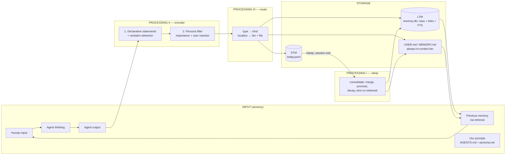

# sundai_memory — build plan

Concept diagrams (loop, evolution, lanes): https://claude.ai/code/artifact/ceb1415f-eabe-476b-a163-084861407fa0

A memory-writing layer for coding/assistant agents, built as a **pi extension**.
Three processes from the whiteboard: **Input → Processing → Storage**, plus the
**read path** (retrieval) and the **sleep** cycle that ties them together.

The pitch: most agent memory today is "dump facts into a vector DB". Ours
models *how memory forms*: what is worth remembering (persona filter, user
reaction to the agent), what must be kept verbatim, where it goes (router), and
how it strengthens or fades over time (activation, sleep consolidation).

---

## 1. Whiteboard → architecture



Board item → what it becomes in code:

| Whiteboard                                   | Implementation                                                                 |
|----------------------------------------------|--------------------------------------------------------------------------------|
| Input 1: conversation (human / thinking / out) | pi `agent_end` event gives the turn's messages; `ctx.sessionManager.getEntries()` gives full history |
| Input 2: previous memory (retrieval)          | `before_agent_start` hook injects always-on files + top-k retrieved memories   |
| Input 3: our prompts                          | `AGENTS.md` (pi loads it) + `persona.md` (ours, editable)                      |
| Processing II (1): declarative statements, verbatim | `encoder.ts`: LLM call → JSON candidates with `verbatim` flag           |
| Processing II (2): persona filter, human reaction | same call, fields `importance`, `user_reaction`; persona.md is in the prompt |
| Processing III: router (type, location)       | `router.ts`: pure rules `candidate → {kind, tier, location}`                   |
| Processing I: consolidation, sleep, LTM/STM   | `sleep.ts`: runs on `session_shutdown` and `/sleep`                            |
| "Fire together wire together"                 | retrieval log → sleep strengthens `links` between co-retrieved memories        |
| CRUD / activation / hard to delete            | `activation.ts`: recency + frequency + importance; soft delete only            |
| Storage: SQL / vector / graph / MD            | **one SQLite file** (rows = SQL, `links` table = graph, FTS5 + optional embeddings = vector) + MD export |
| Outcome measures (board v1)                   | `eval/`: save latency, retrieve latency, recall@k, precision, verbatim fidelity, tokens injected |

---

## 2. Why pi, and the hooks we use

pi (`@earendil-works/pi-coding-agent`) loads TypeScript extensions from
`.pi/extensions/*.ts` in the project, so anyone who clones this repo and runs
`pi` inside it gets the memory layer with no fork. Everything we need exists:

| Need                                  | pi API                                                                 |
|---------------------------------------|------------------------------------------------------------------------|
| See each finished turn                | `pi.on("agent_end", (event, ctx) => ...)` → `event.messages`           |
| Inject memory before the model runs   | `pi.on("before_agent_start", ...)` → return `{ systemPrompt, message }` |
| Don't lose memories to compaction     | `pi.on("session_before_compact", ...)` → encode the messages about to be summarized |
| Run sleep on exit                     | `pi.on("session_shutdown", ...)`                                        |
| Manual controls                       | `pi.registerCommand("sleep" | "memory" | "forget", ...)`               |
| Let the agent store/recall explicitly | `pi.registerTool({ name: "memory_search" | "memory_save" | "memory_forget" })` |
| Read full history                     | `ctx.sessionManager.getEntries()` / `.getBranch()`                      |
| Persist non-context state             | `pi.appendEntry("memory-state", {...})`                                 |

LLM calls from inside the extension (encoder, sleep): use pi's provider layer
(`ctx.model` / `ctx.modelRegistry`, same API keys as the agent) with a cheap
model such as `claude-haiku-4-5-20251001`. Verify the exact import from the
pi-ai package when scaffolding; fallback is a direct Anthropic SDK call.

---

## 2b. Proposal: capture first, consolidate with hindsight

Questioning the whiteboard order. The pipeline (encoder → router → store → sleep) asks the
encoder to judge what is worth keeping at the moment it is said, before anyone can know, and it
cannot see the user's reaction because that arrives one turn later. Proposed order:

```
turn ──agent_end──▶ CAPTURE (append episode verbatim, ~1 ms, + keyword salience tag, no LLM)
                    └──▶ EPISODIC store (raw turns, FTS, time; memory_search digs here)
                            └──batch──▶ SLEEP  micro (idle) · macro (session end)
                                         1. encode with hindsight (sees reaction + outcome)
                                         2. route: fact → SEMANTIC · rule → PROCEDURAL
                                         3. consolidate: merge · decay · wire links
salience fast-track: explicit rules ("never", "always", corrections) land in MEMORY.md immediately
reflex retrieval every turn: always-on files + top-k semantic + recent episodes
```

What changes vs. the whiteboard:

- Processing II and III move out of the hot path and into sleep (Processing I). One process, run with the whole day in view.
- Three stores by role (episodic, semantic, procedural) instead of four by index type. Graph, vector, SQL, markdown are indexes on them; one SQLite file + two markdown exports still covers all four.
- Verbatim is free: the episode log is never rewritten, only extracted from.
- Save latency becomes an append; LLM calls drop from one per turn to a batch per sleep (can afford a stronger model).
- Risk: crash before sleep. Fix: consolidate pending episodes at the next session start.

If the team says no, section 4 stands and the encoder lane runs per turn. Lanes are the same either way.

---

## 2c. What evolves, level by level

Each sleep is one generation: mutate the genome into ~3 candidates (one change each), replay them
against the session's logged retrievals + six fixture sessions (no live agent, seconds), keep the
best. The genome is four small files — `weights.json`, `encoder.lessons.md`, `persona.md`,
`tiers.json` — written to `generations/gen-NNN/`, so every generation is a readable diff and a bad
one is a revert. Safety rules are never mutated.

| Level | What changes | How | Fitness | Today |
|-------|--------------|-----|---------|-------|
| Contents | which memories exist, activation, links | consolidation (learning, not evolution) | — | yes |
| Weights | decay λ, sim/activation blend, k, promotion + dormancy thresholds, always-on caps, salience keyword weights | mutate one number, replay, select (1+3 ES) | recall@k, tokens injected | yes |
| Policies | encoder lessons + few-shot examples, persona.md, standing rules → MEMORY.md / AGENTS.md / skills | LLM proposes a textual mutation from the signals; fixture replay decides | recall/precision of extracted facts, corrections per session | yes |
| Structure | tier table (which kinds ride in every prompt), new kinds proposed from unclustered memories, link types | sleep proposes, replay selects on tokens vs recall | tokens vs recall | tier table yes; new kinds stretch |
| Code | the extension, the schema | humans + git, deliberately not evolved | — | no |

---

## 2d. Landscape: who else is doing this (surveyed 6 Sep 2026)

Nobody found combines (1) capture-first encoding with hindsight, (2) the human's reaction as the
salience signal, (3) a memory policy that evolves per generation. Each piece exists somewhere.

| System | Captures | Judges when | Sleep / background | Models the human | Evolves policy | Take |
|--------|----------|-------------|--------------------|------------------|----------------|------|
| Recall (recall.works, MIT, MCP, Docker) | explicit tools remember/checkpoint/reflect/anti_pattern; append-only markdown + rebuildable vector index | agent, at write time | none; soft-archive | no | no | append-only artifacts; claims/locks if 6 agents share a brain |
| Letta sleep-time compute / dreaming | agent edits memory blocks in a git-backed memory dir | mostly background | yes: background subagent reviews recent turns, after N steps or on compaction, optional review pass | as content | no (developer steers) | triggers after N steps + on compaction; review-before-apply; git-backed memory = generations/ |
| Hindsight (Vectorize, MIT) | retain → world facts / experience / entity observations / opinions with confidence | at ingest | reflect | observations, no reaction signal | no | opinions-with-confidence as a kind; 91.4% LongMemEval |
| Honcho (Plastic Labs) | sync store + index (~200 ms context); proprietary model writes conclusions per peer | background | yes, "dreaming": pattern id, hypothesis testing, conclusion weighting, conflict resolution | yes, first class: (observer, observed) peers, sentiment over time; no reaction-to-agent signal | no | persona filter done properly; hypothesis testing for opinions |
| Mnemosy (mnemosy.ai, MIT) | 12-step zero-LLM ingest <50 ms; 7 types; Qdrant + FalkorDB + Redis | at ingest, no LLM | yes: 4-phase consolidation (contradiction, dedup, promote, demote); log decay, core/procedural immune; soft delete | ToM about other agents; explicit feedback tool | contents only: >0.7 feedback ratio after 3 retrievals auto-promotes | closest overall; take type-immune decay, diversity rerank, proactive recall. Its feedback is a tool call, ours is inferred from the next human turn |
| Zep / Graphiti | raw episodes → bi-temporal facts → communities | at ingest (LLM) | community summaries | no | no | valid_from / valid_to instead of supersedes |
| Mem0 | per message: LLM decides add/update/delete/noop | hot path | no | preferences as facts | no | the archetype of judge-at-write-time |
| GBrain (MIT) | signal detector per message, markdown pages, zero-LLM auto-link on write | overnight | yes: 24/7 cron daemon + overnight dream cycle | people pages | structure only: schema detect/suggest/review with human gate | zero-LLM wiring; schema evolution with a human gate |
| Hermes agent | MEMORY.md + USER.md, char-capped, always injected | agent + background self-improvement review | light | USER.md | no | always-on tier with caps; injection scan on entry |
| LangMem | semantic / episodic / procedural managers; names "hot path vs background" | either | background recommended | profiles | procedural = prompt optimisation from feedback | validates rule graduation |

Research: MemRL (runtime utility on episodes from feedback, no weight updates) = our activation from
usefulness. EvolveMem (evolves retrieval scoring/fusion from failure logs, revert-on-regression,
+25.7% LoCoMo) = our genome loop. Insight governance (rules + evidence logs; activate / suppress /
retire) = our rule graduation. SSGM: decouple evolution from execution, consistency check, decay,
rollback. Counterpoint — "Control-plane placement shapes forgetting" (13 configurations): LLM
forgetting decisions belong on the mutation path (78–85% intent-aware deletion) not in background.

Design changes adopted from the survey:

1. Explicit forget / supersede intents ("forget that", "actually it's X") ride the salience fast-track, not sleep.
2. Facts carry `valid_from` / `valid_to` (bi-temporal), not only a `supersedes` pointer.
3. Sleep also fires after N steps and on compaction (micro-sleep), not only at session end.
4. Genome changes: consistency check + revert-on-regression; `generations/` gives rollback.
5. Anything entering the always-on files is injection-scanned.
6. From Mnemosy: core and procedural kinds are immune to decay; reflex retrieval adds a diversity rerank and a speculative query from the incoming prompt.

Why still build: Mnemosy has the closest shape but its learning stops at promoting individual
memories, its ingest has no hindsight pass, and it needs three services where we need one file.
Every system above is scored on QA over old conversations (LoCoMo, LongMemEval).
None measures whether the agent stopped making the mistake the user corrected. "Corrections per
session" is the metric nobody reports; the reaction signal is the mechanism nobody uses.

---

## 3. Data model

One SQLite file (`node:sqlite`, no native deps; FTS5 confirmed working on
Node 25 locally). Runtime data lives in `./.memory/` (gitignored) during the
hack; configurable to `~/.pi/agent/memory/` later.

```sql
CREATE TABLE memories (
  id            TEXT PRIMARY KEY,
  kind          TEXT NOT NULL,      -- profile | preference | fact | episode | procedure | feedback | verbatim
  tier          TEXT NOT NULL,      -- stm | ltm | always   (always = exported into USER.md / MEMORY.md)
  content       TEXT NOT NULL,      -- declarative statement, or the exact verbatim string
  verbatim      INTEGER DEFAULT 0,  -- 1 = never paraphrase, exact-match retrieval
  importance    REAL DEFAULT 3,     -- 1..5 from the persona filter
  user_reaction TEXT,               -- approving | neutral | correcting | frustrated
  entities      TEXT,               -- JSON array
  source_session TEXT,
  created_at    TEXT, last_accessed TEXT,
  access_count  INTEGER DEFAULT 0,
  activation    REAL DEFAULT 1.0,   -- recomputed at sleep
  status        TEXT DEFAULT 'active', -- active | dormant | deleted (soft)
  supersedes    TEXT,               -- id of the memory this one replaces
  embedding     BLOB                -- optional
);
CREATE VIRTUAL TABLE memories_fts USING fts5(content, entities, content='memories', content_rowid='rowid');

CREATE TABLE links (             -- the graph
  src TEXT, dst TEXT, kind TEXT, -- co_retrieved | same_entity | supersedes | caused_by
  weight REAL DEFAULT 1.0,
  PRIMARY KEY (src, dst, kind)
);

CREATE TABLE retrieval_log (     -- "fire together": consumed by sleep
  turn_id TEXT, memory_id TEXT, ts TEXT
);
```

Files:

- `persona.md` — who the user is and what matters to them (seeded template, hand-editable). Input to the persona filter.
- `.memory/USER.md` — generated profile/preferences, char-capped (~500 tokens). Always in context.
- `.memory/MEMORY.md` — generated agent notes + feedback/corrections, char-capped (~800 tokens). Always in context.
- `.memory/today.jsonl` — STM: raw candidates from this session, consumed by sleep.

Activation (ACT-R flavoured, simple version):

```
activation = importance/5 * exp(-λ · days_since_last_access) + 0.2 · ln(1 + access_count) + feedback_bonus
retrieval_score = 0.6 · text_similarity + 0.4 · activation
dormant when activation < 0.1   (still searchable with memory_search --deep; never hard-deleted)
```

---

## 4. The three pipelines

### Write path (every turn, background, non-blocking)

1. `agent_end` fires → grab the last user message, agent thinking/output, tool results.
2. **Encoder (Processing II)** — one structured LLM call with: the turn, `persona.md`,
   the 5 most related existing memories (so it can emit `supersedes`). Output:

   ```json
   { "memories": [
     { "content": "User is allergic to shellfish.",
       "kind": "profile", "verbatim": false, "importance": 5,
       "entities": ["user", "allergy"], "user_reaction": null, "supersedes": null },
     { "content": "git commit -m \"...\" --no-verify is NOT allowed in this repo",
       "kind": "feedback", "verbatim": true, "importance": 4,
       "entities": ["git"], "user_reaction": "correcting", "supersedes": null }
   ] }
   ```

   Two ideas from the board live in this call: *declarative statements + verbatim
   detection* (1) and *persona filter + modelling the human's reaction to the
   agent's output* (2). A correction or frustration is the strongest signal that
   something is worth remembering.
3. **Router (Processing III)** — rules, no LLM:

   | kind                 | tier    | location                              |
   |----------------------|---------|---------------------------------------|
   | profile, preference  | always  | USER.md + memory.db                   |
   | feedback             | always  | MEMORY.md + memory.db                 |
   | verbatim             | ltm     | memory.db (FTS exact), never paraphrased |
   | fact, episode        | stm     | today.jsonl → promoted by sleep       |
   | procedure            | ltm     | memory.db (stretch: export as a pi skill) |

4. Write. Log latency (outcome measure: "how quickly is memory saved").

### Read path (start of every agent run)

1. `before_agent_start` → build the memory block:
   - always-on: `USER.md` + `MEMORY.md` (capped)
   - top-k (k≈8) from memory.db: FTS5 over the new user prompt (+ embeddings if enabled), re-ranked by activation
2. Append as `<memories>` to the system prompt; bump `access_count`, `last_accessed`; write `retrieval_log`.
3. Agent also has `memory_search` / `memory_save` / `memory_forget` tools for explicit recall and verbatim saves.

### Sleep (Processing I) — `/sleep`, `session_shutdown`, optional cron

1. Promote: STM candidates → LTM; merge near-duplicates (FTS + LLM judge on the ambiguous ones); apply `supersedes`.
2. Decay: recompute activation for every row; mark dormant below threshold.
3. Wire: for memories that appeared together in `retrieval_log`, increase `links.weight` (co_retrieved); add `same_entity` links.
4. Regenerate `USER.md` / `MEMORY.md` from the `always` tier, respecting caps (highest activation wins).
5. Print a consolidation report (promoted / merged / dormant / links) — this is a demo moment.

---

## 5. Repo layout

```
sundai_memory/
  PLAN.md                 this file
  README.md               install + demo script
  persona.md              user persona template (input to the filter)
  package.json            pi package: "pi": { "extensions": ["./src/index.ts"] }
  .pi/extensions/memory.ts   re-exports ./src/index.ts so `pi` in this dir loads it
  src/
    index.ts              hooks, tools, commands                  (harness lane)
    types.ts              Candidate, Memory, Link, Store interface (write FIRST)
    encoder.ts            Processing II
    router.ts             Processing III
    retrieval.ts          read path + memory block builder
    sleep.ts              Processing I
    activation.ts
    store/sqlite.ts       memory.db
    store/markdown.ts     USER.md / MEMORY.md export
  prompts/
    encoder.md, merge.md
  eval/
    scenarios/*.json      multi-session scenarios with gold facts
    run.ts                metrics
  .memory/                runtime data, gitignored
```

---

## 6. Workstreams — six people, six Claude accounts

Rules that let six Claude Code sessions write code at once:

- `src/types.ts` is the only shared file (Candidate, Memory, Link, Store). Written together first, changed only by agreement.
- One lane, one directory. A person's Claude never edits outside its lane. Fixtures in `eval/fixtures/` let lanes 1–4 run without pi.
- Branch per lane, small PRs to `main`, the spine owner integrates. Anyone can run `pi` in the repo to try the whole thing.

| Lane | Owner | Builds | Done when |
|------|-------|--------|-----------|
| **0. Spine** | open | `src/index.ts`, `.pi/extensions`, tools, slash commands, `package.json` | a string saved in session A shows up in session B's prompt |
| **1. Encoder** (P-II) | open | `src/encoder.ts`, `prompts/encoder.md` | 5 fixture transcripts → candidates with `verbatim` and `user_reaction` filled in |
| **2. Store + router** (P-III, LTM) | Matthew | `src/store/`, `src/router.ts`, `src/activation.ts` | CRUD, FTS5, links, MD export pass a small test file |
| **3. Sleep** (P-I) | Oman | `src/sleep.ts` | `/sleep` on a seeded today.jsonl prints a correct consolidation report |
| **4. Evolution** | open | `src/evolve.ts`: lessons writer, weight tuner, generation metrics | three replayed generations produce the fitness table |
| **5. Eval + pitch** | open | `eval/`, scenarios, README, demo script, slides | 5-minute demo rehearsed with numbers by 7:30 pm |

Timeline for today (demo at 8:00 pm): 3:30 lock types.ts + scaffold spine · 4:00 lanes build against fixtures · 6:00 integrate on main, run the two-session demo · 7:00 fitness numbers, pitch, rehearsal · 7:45 code freeze.

---

## 6b. How it adapts and evolves (hackathon theme)

Each sleep is a generation. The inner loop stores memories; the outer loop changes the storing itself.

Signals collected during a session: for every injected memory, whether the agent used it; for every turn, whether the user approved or corrected; per session, recall@k, tokens injected, time to save.

What sleep rewrites from those signals:

1. `prompts/encoder.lessons.md` — per memory kind and source, how often stored memories were later retrieved and used. The sorting hat gets pickier where it was wasteful and more generous where it missed things.
2. Retrieval weights — small grid search over decay rate λ, similarity/activation blend and k against the logged queries.
3. `persona.md` — rewritten from profile/preference memories and reaction history.
4. Rules — a feedback memory that keeps firing graduates from MEMORY.md into AGENTS.md or a pi skill. The agent evolves its own operating rules from how the human reacted.

Fitness, measured after every sleep on the same six replayed scenario sessions: recall@k up, corrections per session down, tokens injected per turn down, time to save down. Demo proof: replay through three sleeps, show the table after each generation.

---

## 7. Demo script (5 min)

1. `pi` in the repo → session A. Say: building the SundAI memory demo, deploy target is Vercel, allergic to shellfish, "never put emojis in commit messages". Let the agent draft a commit with an emoji; correct it.
2. `/memory` → show the STM candidates that were extracted in the background, including the `feedback` memory with `user_reaction: correcting`.
3. `/sleep` → consolidation report; open the regenerated `USER.md` / `MEMORY.md`.
4. New session B: "pick a lunch spot for the team" (avoids shellfish), "write the commit" (no emoji), "what did we decide about deploy?" (Vercel). Show the injected `<memories>` block and the activation bumps.
5. Eval table from `eval/run.ts`.

---

## 8. Decisions to make now (recommendation first)

1. **One SQLite substrate** (rows + links + FTS = SQL + graph + vector) with MD export, instead of four separate stores. GBrain becomes a `Store` adapter later if we want its graph UI.
2. **No embeddings for v1.** FTS5 + activation is enough for the demo. Add embeddings (OpenAI `text-embedding-3-small` or a local MiniLM via transformers.js, on-theme with the board's SLM idea) only if lanes 0–3 are green.
3. **Extraction is background and per-turn**, on a cheap model, never blocking the user's turn. Consolidation is explicit (`/sleep`) plus session end.
4. **Always-on tier is two capped files** (Hermes-style USER.md + MEMORY.md); everything else is retrieved top-k.
5. **Never hard-delete.** Dormancy through activation; `/forget` is a soft delete.

## 9. Stretch

- GBrain `Store` adapter and graph visualisation of `links`.
- Local SLM encoder (1–2B model via llama.cpp; pi has `/llama`) to match the board's "LLM 1.7B / 1B" idea.
- Dedicated user-reaction classifier and an emotional weight in activation (the "neurotransmitter" note).
- Export `procedure` memories as pi skills.
- Encode before compaction so nothing is lost when context is summarized.
